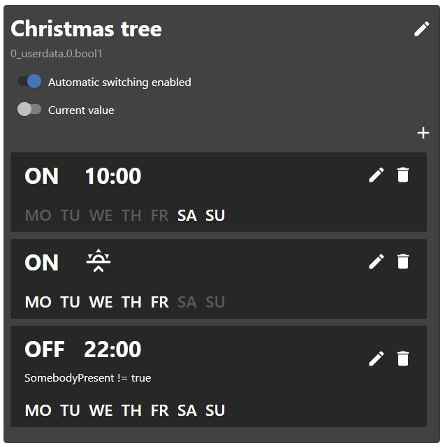

# ioBroker.time-switch

**Tests:**: 

## time-switch adapter for ioBroker

This adapter allows the user to switch devices on and off using time schedules. 
The schedules can be fully configured by a vis widget.
One schedule switches one ioBroker state and consists of one or more actions that define when and how the state should be switched. 
It is possible to configure at which time and on which weekdays the action should be triggered. There can be custom on/off values also.
In the widget the schedule can be disabled temporarily and the switched state can be controlled manually.

## How to setup a schedule

  1. Install the adapter and create an instance (one instance can handle many schedules) 
  2. Go to the instance settings and click "Add schedule" to create a new schedule (one schedule can switch one ioBroker state).
     
     Keep the schedule OID of the newly created schedule in mind, we will need that later.
  3. Now go to the vis editor and open the view where the schedule should be visible.
     Create a new "Device-Schedule" widget and adjust it's size and position to fit your layout.
  4. Now configure the widget with the following properties found under the "Common" attributes:
   
     - dataId: Open the select OID dialog and select the schedule OID that you remembered earlier. It can be found under "time-switch.0".
     - stateId: Select the OID of the state that should be switched by the schedule, e.g. on/off status of a wall plug.
     - onValue/offValue: Enter the values that represent the devices on/off state, e.g. 0/1, true/false, ON/OFF, ... .
  5. Everything else can be configured in the view part of the widget.
   
     - Enable/Disable automatic switching
     - Change the current value of the state
     - Add/Delete/Edit actions
     - Change the heading of the schedule plan
     
## Possible features in the future

- Translations for schedule widget
- Astro actions (switch on sunrise, etc.)

## Changelog

### 1.0.0
* (walli545) initial release, features:
    * Admin settings to create schedules
    * vis widget to edit schedules and add actions
    

## License
MIT License

Copyright (c) 2019 walli545 <walli5446@gmail.com>

Permission is hereby granted, free of charge, to any person obtaining a copy
of this software and associated documentation files (the "Software"), to deal
in the Software without restriction, including without limitation the rights
to use, copy, modify, merge, publish, distribute, sublicense, and/or sell
copies of the Software, and to permit persons to whom the Software is
furnished to do so, subject to the following conditions:

The above copyright notice and this permission notice shall be included in all
copies or substantial portions of the Software.

THE SOFTWARE IS PROVIDED "AS IS", WITHOUT WARRANTY OF ANY KIND, EXPRESS OR
IMPLIED, INCLUDING BUT NOT LIMITED TO THE WARRANTIES OF MERCHANTABILITY,
FITNESS FOR A PARTICULAR PURPOSE AND NONINFRINGEMENT. IN NO EVENT SHALL THE
AUTHORS OR COPYRIGHT HOLDERS BE LIABLE FOR ANY CLAIM, DAMAGES OR OTHER
LIABILITY, WHETHER IN AN ACTION OF CONTRACT, TORT OR OTHERWISE, ARISING FROM,
OUT OF OR IN CONNECTION WITH THE SOFTWARE OR THE USE OR OTHER DEALINGS IN THE
SOFTWARE.
